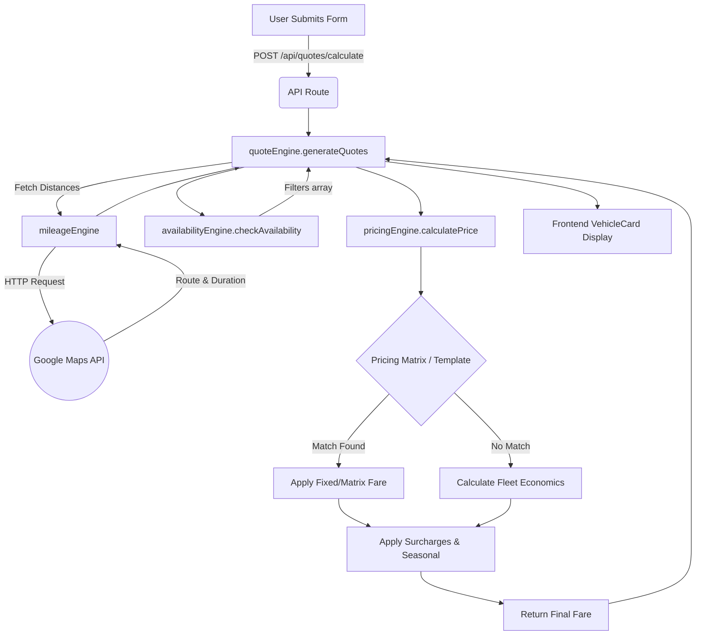

# Fare Calculator Implementation details

## Files Involved
*   **`components/CaroleanCoaches.tsx`**: The main frontend React component containing the user quote form, admin dashboard UI, and a client-side fallback `calcFare` method.
*   **`app/api/quotes/calculate/route.ts`**: The Next.js API route that handles the POST request from the frontend and invokes the quote engine.
*   **`server/quoteEngine.ts`**: Coordinates the entire backend quotation process (mileage, availability, pricing, formatting).
*   **`server/mileageEngine.ts`**: Interacts with the Google Maps API to calculate the `liveKm` (route) and `deadKm` (yard to pickup/dropoff).
*   **`server/pricingEngine.ts`**: Contains the core algorithmic logic and mathematics to evaluate matrices, fleet economics, and surcharges.
*   **`server/availabilityEngine.ts`**: Filters out vehicles that are unavailable due to blocked dates or lack of passenger/luggage capacity.
*   **`server/db.ts`**: Serves as the pseudo-database connection, reading and writing to a local JSON file (`db.json`) for persistent configuration.
*   **`app/api/bookings/route.ts`**: Handles the final ride booking submission by writing the payload to the local JSON database.

## Calculation Trace (Step-by-Step)
1.  **User Action**: The user fills out the booking form in `CaroleanCoaches.tsx` and clicks "Get instant quote".
2.  **Frontend State**: The `buildQuotes` function in `CaroleanCoaches.tsx` fires, setting loading state to true and sending a POST request to `/api/quotes/calculate`.
3.  **API Handler**: `app/api/quotes/calculate/route.ts` receives the JSON payload (origin, destination, dates, waypoints, passenger counts) and calls `generateQuotes(journey)`.
4.  **Mileage Calculation**: `quoteEngine.ts` calls `calculateMileage(journey)` in `mileageEngine.ts`. This contacts the Google Maps API up to 3 times (Live Route, Depot to Pickup, Drop-off to Depot) and returns distance/duration data.
5.  **Iteration & Filtering**: `quoteEngine.ts` iterates over every vehicle configured in the database. It calls `checkAvailability` in `availabilityEngine.ts` to skip vehicles that are too small or booked out.
6.  **Pricing Calculation**: For available vehicles, `quoteEngine.ts` calls `calculatePrice(input)` in `pricingEngine.ts`.
7.  **Price Logic Execution**: Inside `pricingEngine.ts`:
    *   Checks for Route Templates. If none...
    *   Checks the Pricing Matrix. If none...
    *   Calculates Fleet Economics (standing + variable costs).
    *   Applies Surcharges (ULEZ, CAZ, overnight, luggage).
    *   Applies Seasonal Multipliers.
8.  **Return to Client**: `quoteEngine.ts` bundles the structured `result` and `vehicle` into an array and returns it to `route.ts`, which sends it back to the client as JSON.
9.  **Display**: The frontend `CaroleanCoaches.tsx` updates the `quotes` state, rendering the results on the screen via the `VehicleCard` component.

## Integrations & Services
*   **Google Maps API**: Heavily utilized for geocoding, autocomplete (frontend), and directions (backend). Uses the `directions/json` endpoint for routing logic.
*   **Local JSON Database**: All configurations, matrix rules, vehicles, and final booking saves are read/written to a local JSON file via `server/db.ts`.
*   *Note: No third-party payment gateways (Stripe, PayPal) are integrated in this specific fare calculation flow. It relies purely on the local DB.*

## Data Flow Diagram

## Caching & State Management
*   **Frontend Debouncing**: The `buildQuotes` function is wrapped in a 400ms `setTimeout` debounce in a `useEffect` hook. This prevents spamming the calculation API while the user changes inputs (like passengers or luggage).
*   **Database Memory Cache**: The `server/db.ts` file acts as an in-memory singleton. It loads the `db.json` file once and caches the object, preventing aggressive disk reads on every calculation request.
*   **Fallback State**: If the backend API fails (e.g., network error or missing Google API key), `CaroleanCoaches.tsx` has a `catch(err)` block that utilizes its own local `calcFare` and dummy Haversine functions to ensure the user still receives a quote.

## Places where Fare/Price is Displayed

1.  **Vehicle Card Summary List**
    *   **File/Component**: `CaroleanCoaches.tsx` -> `VehicleCard` function.
    *   **What is shown**: Total Est. Fare (`£{fmt(result.finalPrice)}`).
    *   **Source**: Calculated live when the quote request returns.
2.  **Checkout / Final Confirmation Section**
    *   **File/Component**: `CaroleanCoaches.tsx` -> Right-hand "Checkout Card" panel.
    *   **What is shown**: Selected Category Est. Fare (`£{fmt(activeResult?.finalPrice || 0)}`).
    *   **Source**: Calculated live, pulled from the currently active `selected` vehicle state.
3.  **Admin Dashboard: Fleet Economics Panel**
    *   **File/Component**: `CaroleanCoaches.tsx` -> `FleetEconomicsPanel` function.
    *   **What is shown**: Annual fleet costs, overheads, Daily Standing costs (`£{v.dailyStanding}`), Minimum Hire per day (`£{v.minHirePerDay}`).
    *   **Source**: Calculated live by the `fleetEconomics()` frontend function, derived dynamically from variables saved in the database configuration.
4.  **Admin Dashboard: Pricing Matrix Table**
    *   **File/Component**: `CaroleanCoaches.tsx` (Inside the Admin Dashboard tab).
    *   **What is shown**: Fixed base fares and extra mileage rates.
    *   **Source**: Pulled directly from stored database data (`/api/admin/pricing-matrix`).
5.  **Admin Dashboard: Seasonal Multipliers**
    *   **File/Component**: `CaroleanCoaches.tsx` (Inside the Admin Dashboard tab).
    *   **What is shown**: Price Multipliers (e.g., `1.2x`).
    *   **Source**: Pulled directly from stored database data (`/api/admin/seasonal`).
